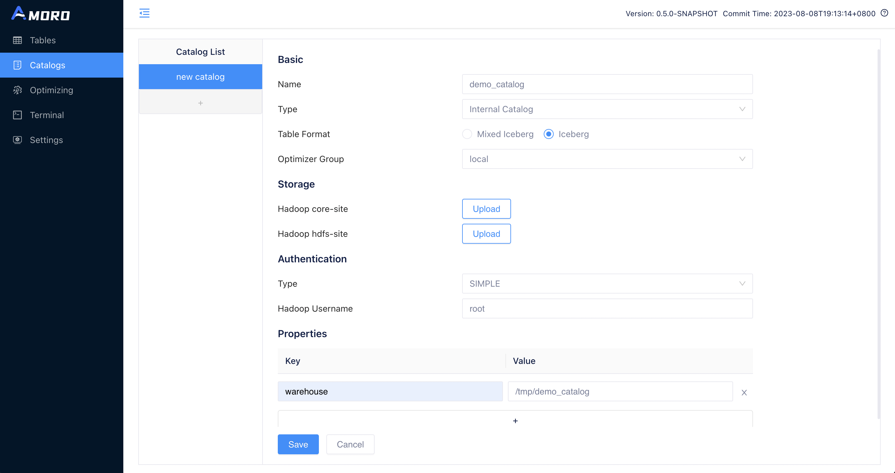
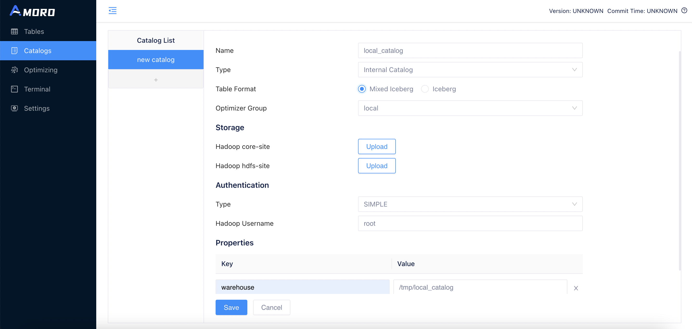
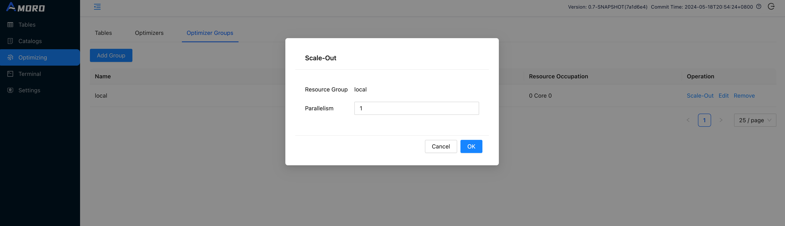
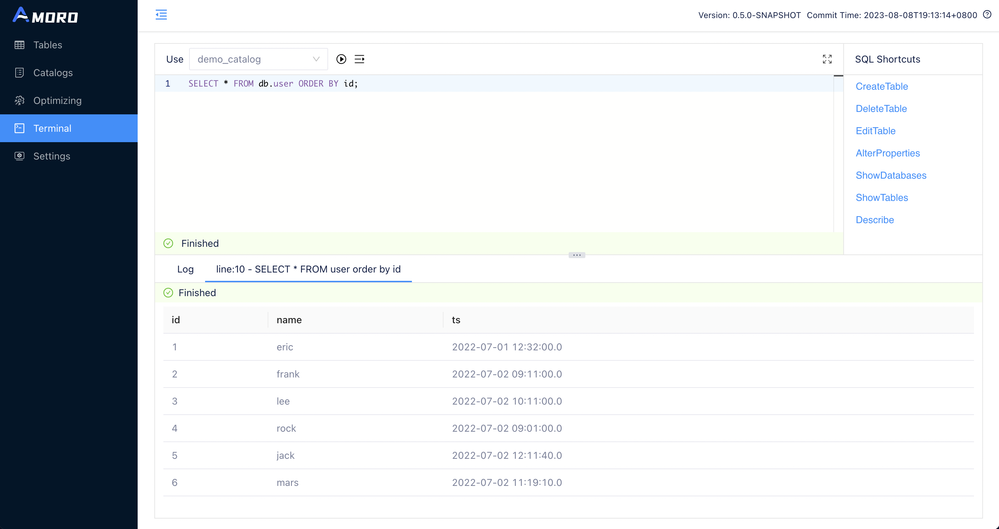
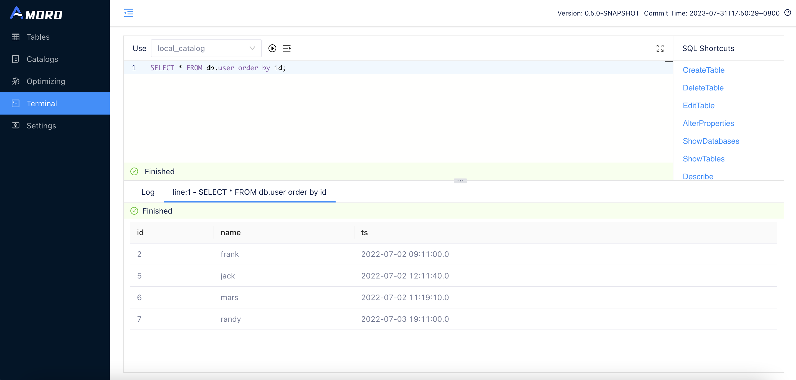

# Quick Demo

This guide outlines the basic process of using Amoro, allowing you to quickly experience its core features. You can choose to use either the `Iceberg Format` or the `Mixed-Iceberg Format` to complete the entire process. 

If you are more interested in the `Mixed-Hive Format`, you can refer to: [Mixed-Hive Format](/docs/latest/mixed-hive-format/). For specific information on the different formats supported by Amoro, please refer to: [Table Format](/docs/latest/formats-overview/).

Before starting the quick demo, some steps are required to prepare the environment. Here are two ways to complete the necessary preparation:

- [Setup from Docker-Compose](/quickstart-setup/#setup-from-docker-composee)
- [Setup from binary release](/quickstart-setup/#setup-from-binary-release)

## Prepare steps

### Create optimizer group

Open [http://localhost:1630](http://localhost:1630) in a browser, enter `admin/admin` to log in to the dashboard.

Click on `Optimizing` in the sidebar, choose `Optimizer Groups` and click `Add Group` button to create a new group befre creating catalog:


### Create catalog

Click on `Catalogs` in the sidebar, click on the `+` button under Catalog List to create a test catalog, and name it to `demo_catalog`:
{}
{}
{}
{}

To use the Iceberg Format, select `Type` as `Internal Catalog`, and choose `Iceberg` as `Table Format`.


{}
{}

To use the Mixed-Iceberg Format, select `Type` as `Internal Catalog`, and choose `Mixed-Iceberg` as `Table Format`.


{}
{}



If you deployed the demo environment using Docker-Compose:
  - Hadoop configuration files are stored in `<ARCIT-WORKSPACE>/hadoop-config`.
  - Warehouse path should be set to `hdfs://namenode:8020/user/arctic/demo_warehouse`.

If you deployed the demo environment through binary release:
  - Don't need to upload the Hadoop configuration files.
  - Warehouse path should be set a directory which the hadoop user have the read and write privileges.


### Start optimizers

Click on `Optimizing` in the sidebar, select the `Optimizer Group` tab, and click the `scale-out` operation for group `local`.



Set the concurrency of the optimizer to 1 and click `OK`.

Then you can switch the tab to `Optimizer`, you can find the newly launched optimizer here.



You may need to wait for up to 30 seconds for the optimizer to register with AMS.


## Demo setps

### Initialize tables

Click on `Terminal` in the sidebar, you can create the test tables here using SQL. Terminal supports executing Spark SQL statements for now.

{}
{}
{}
{}
```sql
CREATE DATABASE IF NOT EXISTS db;
USE db;
CREATE TABLE IF NOT EXISTS user (
    id INT,
    name string,
    ts TIMESTAMP
) USING iceberg 
PARTITIONED BY (days(ts));

INSERT OVERWRITE user VALUES 
(1, "eric", timestamp("2022-07-01 12:32:00")),
(2, "frank", timestamp("2022-07-02 09:11:00")),
(3, "lee", timestamp("2022-07-02 10:11:00"));

SELECT * FROM user;
```
{}
{}
```sql
CREATE DATABASE IF NOT EXISTS db;
USE db;
CREATE TABLE IF NOT EXISTS user (
    id INT,
    name string,
    ts TIMESTAMP,
    PRIMARY KEY(id)
) USING arctic 
PARTITIONED BY (days(ts));

INSERT OVERWRITE user VALUES 
(1, "eric", timestamp("2022-07-01 12:32:00")),
(2, "frank", timestamp("2022-07-02 09:11:00")),
(3, "lee", timestamp("2022-07-02 10:11:00"));

SELECT * FROM user;
```
{}
{}

Click on the `RUN` button uppon the SQL editor, and wait for the SQL query to finish executing. You can then see the query results under the SQL editor.

### Start Flink ingestion job

If you have prepared the environment using Docker-Compose, you can open a terminal in docker using the following command:

```shell
docker exec -it ams bash
```

Then you can start the standalone Flink cluster using the following command:

```shell
cd <FLINK_DIR>

./bin/start-cluster.sh
```

After you start the Flink cluster, you can open the Flink dashboard by visiting [http://localhost:8081](http://localhost:8081).

Then execute the following command to start the Flink SQL Client:

```shell
./bin/sql-client.sh embedded
```

Enter the following SQL statements one by one to start the Flink ingestion job since the Flink SQL Client does not support batch SQL input:

{}
{}
{}
{}
```sql
CREATE CATALOG iceberg_catalog WITH (
  'type' = 'iceberg',
  'catalog-impl' = 'org.apache.iceberg.rest.RESTCatalog',
  'uri'='http://127.0.0.1:1630/api/iceberg/rest',
  'warehouse'='demo_catalog'
);

-- Recreate table with Flink as Only Flink support primary key for iceberg format table
DROP TABLE `iceberg_catalog`.`db`.`user`;

CREATE TABLE IF NOT EXISTS `iceberg_catalog`.`db`.`user` (
    id INT,
    name string,
    ts TIMESTAMP_LTZ,
    PRIMARY KEY(id) NOT ENFORCED
) with ('format-version'='2', 'write.upsert.enabled'='true');

INSERT INTO iceberg_catalog.`db`.`user` (id, name, ts) VALUES 
(1, 'eric', CAST('2022-07-01 12:32:00' AS TIMESTAMP)),
(2, 'frank', CAST('2022-07-02 09:11:00' AS TIMESTAMP)),
(3, 'lee', CAST('2022-07-02 10:11:00' AS TIMESTAMP));

-- Create CDC socket source table
CREATE TABLE cdc_source(
  id      INT,
  name    STRING,
  op_time STRING
) WITH (
    'connector' = 'socket',
    'hostname' = 'localhost',
    'port' = '9999',
    'format' = 'changelog-csv',
    'changelog-csv.column-delimiter' = '|'
);

-- Disable Flink engine form filtering on Delete data
set table.exec.sink.upsert-materialize=none;

-- Start the Flink ingestion job
INSERT INTO `iceberg_catalog`.`db`.`user`
SELECT id,
       name,
       CAST(TO_TIMESTAMP(op_time) AS TIMESTAMP(6) WITH LOCAL TIME ZONE) ts
FROM cdc_source;
```
{}
{}
```sql
CREATE CATALOG arctic_catalog WITH (
  'type' = 'arctic',
  'metastore.url'='thrift://127.0.0.1:1260/demo_catalog'
);

-- Create CDC socket source table
CREATE TABLE cdc_source(
  id      INT,
  name    STRING,
  op_time STRING
) WITH (
    'connector' = 'socket',
    'hostname' = 'localhost',
    'port' = '9999',
    'format' = 'changelog-csv',
    'changelog-csv.column-delimiter' = '|'
);

-- Disable Flink engine form filtering on Delete data
set table.exec.sink.upsert-materialize=none;

-- Start the Flink ingestion job
INSERT INTO `arctic_catalog`.`db`.`user`
SELECT id,
       name,
       CAST(TO_TIMESTAMP(op_time) AS TIMESTAMP(6) WITH LOCAL TIME ZONE) ts
FROM cdc_source;
```
{}
{}

Open a new terminal. If you deployed the demo environment using Docker-Compose, you can use the following command to reopen a terminal of the Flink container. The required commands are already installed inside the container.

```shell
docker exec -it flink bash
```

Execute the following command in the newly opened terminal. It will open a socket channel to the `cdc_source` table, allowing us to insert some test data into the table.

```shell
nc -lk 9999
```

Send the following content into the socket channel, and make sure to add a break line after the last line of data to ensure that the last line of data is correctly sent.

```shell
INSERT|4|rock|2022-07-02 09:01:00
INSERT|5|jack|2022-07-02 12:11:40
INSERT|6|mars|2022-07-02 11:19:10

```

Wait for at least 10 seconds (depending on the checkpoint interval configured in flink-conf.yaml), open the `Dashboard` and go to the `Terminal` page, then execute:

```sql
SELECT * FROM db.user ORDER BY id;
```

You will get the following execution result:



Continue to send the following data into the socket channel:

```shell
DELETE|1|eric|2022-07-01 12:32:00
INSERT|7|randy|2022-07-03 19:11:00
DELETE|4|rock|2022-07-02 09:01:00
DELETE|3|lee|2022-07-02 10:11:00

```

Query the content of the test table by `Terminal` again, you will get the following result this time：



### Check self-optimizing

As new data is written to the table, Amoro will automatically trigger self-optimizing on the table.

Click on `Tables` in the sidebar, select the test table to enter the table details page, switch to the `Optimizing` tab, where you can see all the self-optimizing tasks on the table.


You can also enter the `Optimizing` page through the the sidebar to view the current optimizing status of all tables.


For more information on Self-Optimizing, please refer to: [Self-optimizing](/docs/latest/self-optimizing/)